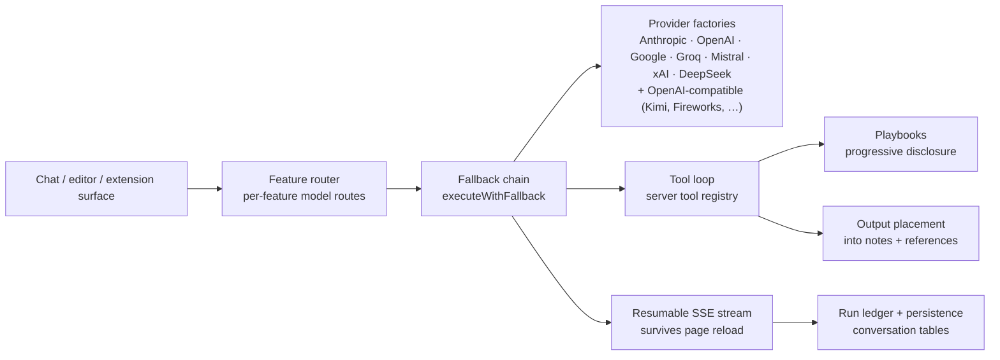
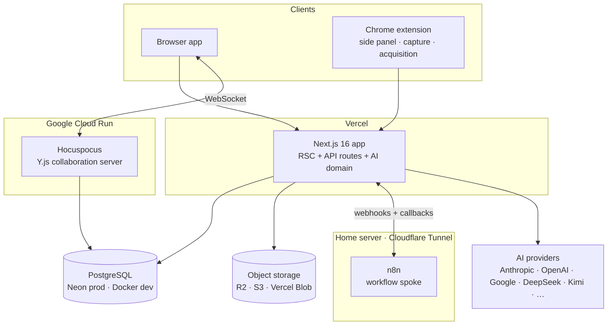

# Digital Garden — an AI-native knowledge IDE

[](https://github.com/CenterValentine/Digital-Garden/actions/workflows/quality.yml)


[](LICENSE)

An Obsidian-class knowledge IDE that grew into an **AI automation platform**: agentic chat with a
typed tool registry, reusable agent playbooks, durable workflows with an n8n spoke, resumable AI
streams, multimodal pipelines (TTS · STT · image), real-time multiplayer editing — multiple people
in the same document at once, live — and a publishing system that renders my actual personal site.

**[Live site →](https://davidvalentine.org)** rendered by this repo's publishing system ·
**[Video demo →](https://davidvalentine.org/demo)** ·
**[Feature inventory →](docs/FEATURES.md)** ·
**[Deployment →](docs/DEPLOYMENT.md)** ·
**[Documentation →](docs/notes-feature/00-START-HERE.md)**

<!-- fig:1-1 -->
<sub>📷 <b>Fig 1-1</b> · <i>Three-panel Content IDE (hero)</i> — <a href="docs/media/figures/FIGURES.md">media pending</a></sub>
<!-- /fig:1-1 -->

Solo-built, production-deployed, and used daily — this is my working environment for notes,
research capture, my published site, and the agentic systems that run my own job search.

---

## AI & agentic systems

Every AI capability here is a first-class subsystem with typed contracts, CI gates, and fallback
behavior — not a chat window bolted onto a notes app. The table maps each capability to where it
lives in the code.

| Capability | What's built | Where |
|---|---|---|
| **Tool-calling orchestration** | Server-side tool registry with a client-safe metadata split (no Prisma in the client bundle); editor, flashcard, and workflow tool families; canonical output-placement so agent output lands *in documents*, not just chat | [`lib/domain/ai/tools/`](lib/domain/ai/tools/) |
| **Multi-model routing + fallback** | Per-feature model routes with fallback chains (`executeWithFallback`), registry-authoritative model catalog, per-model constraints | [`lib/domain/ai/features/`](lib/domain/ai/features/) |
| **Agent playbooks** | Notes/folders marked as reusable playbooks; progressive-disclosure injection (agents load steps as needed, not all upfront); discoverable via a `search_playbooks` tool; checkpoint gating | [`lib/domain/ai/playbooks/`](lib/domain/ai/playbooks/) |
| **Durable workflows** | Visual workflow builder (React Flow) with trigger system and run history, plus an n8n spoke — outbound webhooks and inbound callbacks for jobs that outlive a request | [`extensions/workflows/`](extensions/workflows/) |
| **Resumable streaming** | AI responses stream over SSE and survive a page reload mid-generation (Upstash-backed resumable streams) | [`lib/domain/ai/resumable/`](lib/domain/ai/resumable/) |
| **Resource governance** | Per-run ledger, tool-output compaction to control context growth, dangling-tool-call repair, prompt caching | [`lib/domain/ai/run-ledger.ts`](lib/domain/ai/run-ledger.ts), [`compact-tool-outputs.ts`](lib/domain/ai/compact-tool-outputs.ts) |
| **Grounded learning studio** | Folder Studio: a NotebookLM-parallel studio, minus the source-curation step — any folder's *existing* notes are the source corpus (auto-context assembly, no separate upload/select ritual). Grounded chat plus three generation shelves: Create (reports, flashcards, mind maps, audio/video overviews, slide decks, infographics), Practice (quizzes, oral exams, teach-it-back, study plans), Analyze (glossaries, comparisons, prerequisites) | [`extensions/studio/`](extensions/studio/) |
| **Multimodal pipelines** | TTS generation + storage catalog (read-aloud player), speech-to-text, AI image generation, AI-mediated media injection into notes | [`lib/domain/ai/speech/`](lib/domain/ai/speech/), [`transcribe/`](lib/domain/ai/transcribe/), [`image/`](lib/domain/ai/image/) |
| **Agentic browser reach** | Chrome extension as a content-acquisition provider: service-worker fetch → session-tab ladder, client-mediated with a server-built trust envelope; capture-policy safety gates | [`lib/domain/ai/acquisition/`](lib/domain/ai/acquisition/) |
| **Provider abstraction (BYOK)** | Dedicated factories for Anthropic · OpenAI · Google · Groq · Mistral · xAI · DeepSeek behind one interface, plus a generic OpenAI-compatible connection type covering Moonshot (Kimi), Fireworks, Together, OpenRouter, Ollama, and any other OpenAI-compatible endpoint. Encrypted key storage, gateway routing | [`lib/domain/ai/providers/`](lib/domain/ai/providers/) |
| **MCP interoperability** | 🔭 **Planned** — MCP server exposing garden tools/resources to external agents + MCP client consuming external servers in the chat tool loop (design doc in progress) | — |

### How an AI request flows



<!-- fig:2-1 -->
<sub>📷 <b>Fig 2-1</b> · <i>AI chat executing tools</i> — <a href="docs/media/figures/FIGURES.md">media pending</a></sub>
<!-- /fig:2-1 -->

**Playbooks** turn the agent from a chatbot into an operator: any note or folder can be marked as
a playbook, and agents discover and execute them with steps injected progressively — my job-search
playbook runs this way daily (Fig 2-2). **Workflows** cover the durable side: multi-step
automations built on a visual canvas, executed through triggers and an n8n spoke with callback
verification (Fig 2-3). **Folder Studio** is the NotebookLM-parallel piece: point it at a folder
and its *existing* notes become the grounding corpus — no separate source-upload step — then chat,
or generate study material across three shelves: Create (reports, flashcards, mind maps, audio/video
overviews, slide decks, infographics), Practice (quizzes, oral exams, teach-it-back, study plans),
and Analyze (glossaries, comparisons, prerequisites) (Fig 2-4).

<!-- fig:2-2 -->
<sub>📷 <b>Fig 2-2</b> · <i>Playbook run (progressive disclosure)</i> — <a href="docs/media/figures/FIGURES.md">media pending</a></sub>
<!-- /fig:2-2 -->
<!-- fig:2-3 -->
<sub>📷 <b>Fig 2-3</b> · <i>Workflow canvas + run history</i> — <a href="docs/media/figures/FIGURES.md">media pending</a></sub>
<!-- /fig:2-3 -->
<!-- fig:2-4 -->
<sub>📷 <b>Fig 2-4</b> · <i>Folder Studio grounded chat</i> — <a href="docs/media/figures/FIGURES.md">media pending</a></sub>
<!-- /fig:2-4 -->

Infrastructure details that usually get skipped: streams are **resumable** — reload the page
mid-generation and the response keeps going (Fig 2-5); every run is metered in a ledger; tool
outputs are compacted to keep context windows honest; and models are **user-configurable per
feature** with BYOK keys stored encrypted (Fig 2-7). Text-to-speech, transcription, and image
generation run as first-class pipelines with storage-backed catalogs (Fig 2-6).

<!-- fig:2-5 -->
<sub>📷 <b>Fig 2-5</b> · <i>Resumable stream surviving a reload</i> — <a href="docs/media/figures/FIGURES.md">media pending</a></sub>
<!-- /fig:2-5 -->
<!-- fig:2-6 -->
<sub>📷 <b>Fig 2-6</b> · <i>Read-aloud TTS player</i> — <a href="docs/media/figures/FIGURES.md">media pending</a></sub>
<!-- /fig:2-6 -->
<!-- fig:2-7 -->
<sub>📷 <b>Fig 2-7</b> · <i>Model routing & BYOK connections</i> — <a href="docs/media/figures/FIGURES.md">media pending</a></sub>
<!-- /fig:2-7 -->

---

## Architecture



**ContentNode v2.0** — one polymorphic table is the universal container: folders form the
hierarchy; leaves attach exactly one typed payload (`NotePayload` TipTap JSON, `FilePayload`
binary + storage metadata, `CodePayload`, `HtmlPayload`, `ExternalPayload` with Open Graph
metadata). Soft delete, display ordering, and full-text search live on the container, so every
content type inherits them.

**Real-time multiplayer editing** — multiple people can open and edit the same note at the same
time, live, with each other's cursors and selections visible (Fig 3-2) — powered by Y.js CRDTs
synced through a Hocuspocus server on Cloud Run. Presence survives Vercel's serverless split by
persisting awareness state to Postgres. A CI gate (`collab:schema:check`) statically verifies that
every editor extension has a server-safe variant registered with the collaboration server — schema
drift between client and collab server fails the build, because at runtime it would corrupt
documents that multiple people are editing simultaneously.

**Extension system** — features ship as 10 first-party extension modules
(`daily-notes`, `flashcards`, `people`, `workplaces`, `calendar`, `publishing`, `speed-reader`,
`browser-bookmarks`, `studio`, `workflows`), each owning its manifest, client/server runtimes,
components, and state. Disabled extensions disappear through registry filters — shared UI has no
per-feature conditionals.

---

## Feature tour

### The editor

TipTap-based, with a custom block inventory: wiki-links with autocomplete (`[[Note Title]]`),
Obsidian-style callouts, tabs/columns/accordions, and multiplayer-editable Mermaid and Excalidraw
blocks — several people can sketch on the same diagram at once — plus inline tags and timestamps,
slash commands, and a schema-versioning system with migration support. Unknown node types
round-trip as explicit placeholders instead of being silently dropped.

<!-- fig:1-2 -->
<sub>📷 <b>Fig 1-2</b> · <i>Sixty-second tour</i> — <a href="docs/media/figures/FIGURES.md">media pending</a></sub>
<!-- /fig:1-2 -->
<!-- fig:3-1 -->
<sub>📷 <b>Fig 3-1</b> · <i>Block library breadth</i> — <a href="docs/media/figures/FIGURES.md">media pending</a></sub>
<!-- /fig:3-1 -->
<!-- fig:3-2 -->
<sub>📷 <b>Fig 3-2</b> · <i>Live collaboration</i> — <a href="docs/media/figures/FIGURES.md">media pending</a></sub>
<!-- /fig:3-2 -->

### Publishing

Notes compose into public pages from a registry of publishing blocks (hero, cards, galleries,
pricing, testimonials, …), rendered server-side with light/dark theming and per-block Playwright
visual regression. [davidvalentine.org](https://davidvalentine.org) is this pipeline in
production (Fig 4-2).

<!-- fig:4-1 -->
<sub>📷 <b>Fig 4-1</b> · <i>Publishing composer → live page</i> — <a href="docs/media/figures/FIGURES.md">media pending</a></sub>
<!-- /fig:4-1 -->
<!-- fig:4-2 -->
<sub>📷 <b>Fig 4-2</b> · <i>davidvalentine.org, rendered by this repo</i> — <a href="docs/media/figures/FIGURES.md">media pending</a></sub>
<!-- /fig:4-2 -->

### Browser extension

A Chrome extension embeds the garden in a side panel, captures pages under explicit
capture-policy safety gates, and acts as an **acquisition provider**: when the app needs a page's
full content, it climbs a ladder from service-worker fetch to session-tab extraction — with the
server building the trusted envelope (Fig 5-1).

<!-- fig:5-1 -->
<sub>📷 <b>Fig 5-1</b> · <i>Browser extension side panel & acquisition</i> — <a href="docs/media/figures/FIGURES.md">media pending</a></sub>
<!-- /fig:5-1 -->

### And also

Flashcards with FSRS spaced repetition · daily/periodic notes with activity summaries · people +
workplace entities with mentions · full-text search with tag filtering and backlinks · multi-cloud
file storage with two-phase presigned uploads · an RSVP speed reader · export to Markdown/HTML/JSON
with metadata sidecars.

---

## Engineering practice

The part that doesn't screenshot well but matters most:

- **Quality gates, in order:** `pnpm typecheck` → `pnpm lint` (warning-count ratchet — new
  warnings fail CI) → `pnpm build` → browser smoke test.
- **CI on every PR** ([workflows](.github/workflows/)): lint + typecheck (`quality.yml`),
  collaboration schema coverage (`collaboration-hardening.yml`), and publishing schema +
  per-block visual regression (`publishing-visual.yml`).
- **Static drift detectors** as CI gates: collab-schema coverage, publishing `Server*` variants,
  Zod-default vs. render-fallback drift, dark-mode CSS coverage audits.
- **React Compiler lint rules enforced** — compiler diagnostics are treated as bug reports, and
  they've caught real ones (stale callbacks, StrictMode-unsafe ref writes, render impurity).
- **AI-assisted development, documented:** [`CLAUDE.md`](CLAUDE.md) and [`AGENTS.md`](AGENTS.md)
  encode the repo's conventions for agentic coding tools — the same discipline the product's own
  agents get held to.
- 90+ architecture and workflow documents under [`docs/`](docs/notes-feature/00-START-HERE.md),
  130+ merged PRs in sprint format.

---

## Quickstart

Prerequisites: Node 20+, pnpm, Docker (for local Postgres).

```bash
git clone https://github.com/CenterValentine/Digital-Garden.git
cd Digital-Garden
pnpm install
cp .env.example .env.local
pnpm db:local:up
npx prisma generate
npx prisma migrate deploy
pnpm db:seed
pnpm dev
```

The app runs at **http://localhost:3015**. Required env vars: `DATABASE_URL` (use `localhost`,
not `127.0.0.1`, for the Docker Postgres) and `STORAGE_ENCRYPTION_KEY` (32-byte hex). AI features
need at least one provider key (BYOK — configured in-app). Live collaboration in dev needs the
local Hocuspocus server in a second terminal:

```bash
pnpm dev:collab
```

with `NEXT_PUBLIC_HOCUSPOCUS_URL=ws://localhost:1234` in `.env.local`. Full production builds
need a larger Node heap: `NODE_OPTIONS='--max-old-space-size=8192' pnpm build`.

## Deployment topology

Three services deploy independently:

| Service | Platform | How |
|---|---|---|
| Next.js app | Vercel | `vercel --prod` (build skips local-only gates; migrations run manually via `npx prisma migrate deploy`) |
| Hocuspocus (collab) | Google Cloud Run | `gcloud builds submit --config cloudbuild.hocuspocus.yaml .` — **must be redeployed after schema-changing merges**, or unknown blocks degrade to placeholders |
| n8n (workflow spoke) | Any long-lived host | Self-hosted (here: a home server behind a Cloudflare Tunnel, no inbound ports) |

Postgres (Neon in production) and object storage (Cloudflare R2 primary; S3/Vercel Blob
supported) are managed services. Full guide — env reference, migration baseline caveats, the
Hocuspocus redeploy rules, and post-deploy verification: **[docs/DEPLOYMENT.md](docs/DEPLOYMENT.md)**.

---

## Roadmap

Labeled honestly — nothing below is shipped yet:

- 🔭 **MCP server + client** — expose the garden's tools, content, and playbooks to external
  agents over the Model Context Protocol, and consume external MCP servers inside the chat tool
  loop. Design of record: [MCP-PLAN.md](docs/notes-feature/work-tracking/MCP-PLAN.md) — first
  slice is a read-only server demoable from Claude Desktop.
- 🔭 **Playbook completeness** — SKILL.md import, richer playbook lifecycle.
- 🔭 **Resource budgets** — enforced per-run token/step budgets on top of the existing run ledger.
- 🔭 **Conversation memory** — long-horizon memory bank across chat sessions.

## Documentation & showcase upkeep

- Start here: [`docs/notes-feature/00-START-HERE.md`](docs/notes-feature/00-START-HERE.md)
- Figures in this README are managed by a registry + sync script — see
  [`docs/media/figures/FIGURES.md`](docs/media/figures/FIGURES.md). Drop a correctly-named media
  file in that folder, run `pnpm showcase:figures`, and it appears here automatically.
- Showcase maintenance guide: [`docs/notes-feature/guides/showcase/SHOWCASE-MAINTENANCE.md`](docs/notes-feature/guides/showcase/SHOWCASE-MAINTENANCE.md)

## License & contact

[MIT](LICENSE). If you want to build on something here, [reach out](https://davidvalentine.org/contact).

Built and maintained by [David Valentine](https://davidvalentine.org) ·
[Request a demo](https://davidvalentine.org/demo)
