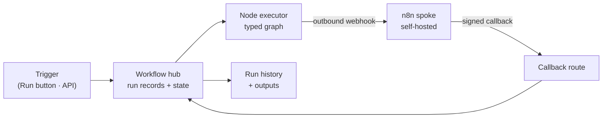
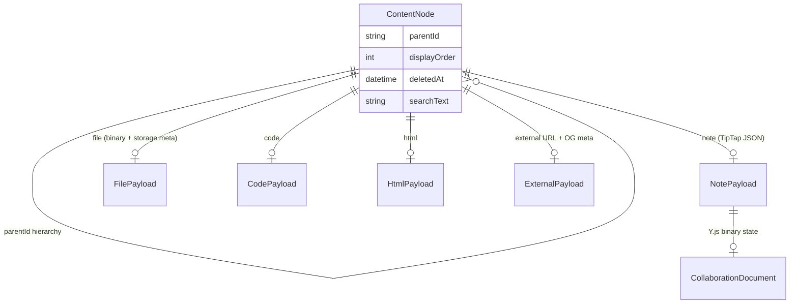

# Feature Inventory

The complete map of what this codebase does, with status and code entry points. Companion to the
[README](../README.md) (positioning + architecture) and [DEPLOYMENT.md](DEPLOYMENT.md) (running it).

**Legend:** ✅ shipped · 🚧 in progress · 🔭 planned — nothing unshipped appears unlabeled.
Figures referenced below are tracked in the [figure registry](media/figures/FIGURES.md).

---

## AI & agentic systems

The headline domain — see the README's competency table for the recruiter-level summary; this is
the full inventory.

| Feature | Status | Notes | Code |
|---|---|---|---|
| Agentic chat engine | ✅ | Shared conversation engine across all chat surfaces; persisted conversations with associations to content | `lib/domain/ai/use-conversation-engine.ts` |
| Server tool registry | ✅ | Editor, flashcard, and workflow tool families; client-safe metadata split (no Prisma in client bundle) | `lib/domain/ai/tools/` |
| Output placement | ✅ | Canonical modules place agent output *into documents* — bot outputs nest under chats as movable references | `lib/domain/ai/output-target.ts`, `tools/output-placement.ts` |
| Playbooks | ✅ | Notes/folders marked as reusable agent procedures; progressive-disclosure injection; `search_playbooks` discovery; checkpoint gating | `lib/domain/ai/playbooks/` |
| Multi-model routing + fallback | ✅ | Per-feature routes, fallback chains, registry-authoritative model catalog, per-model constraints | `lib/domain/ai/features/`, `model-route-resolver.ts` |
| Provider abstraction (BYOK) | ✅ | Dedicated factories: Anthropic · OpenAI · Google · Groq · Mistral · xAI · DeepSeek. Plus a generic OpenAI-compatible connection type for Moonshot (Kimi), Fireworks, Together, OpenRouter, Ollama, and any other OpenAI-compatible endpoint; encrypted key storage; env-key fallbacks | `lib/domain/ai/providers/` |
| Resumable streaming | ✅ | SSE responses survive page reload mid-generation (Upstash-backed) | `lib/domain/ai/resumable/` |
| Resource governance | ✅ / 🔭 | Shipped: per-run ledger, tool-output compaction, dangling-tool repair, prompt caching. Planned: enforced per-run token/step budgets | `run-ledger.ts`, `compact-tool-outputs.ts` |
| Folder Studio (grounded learning) | ✅ | NotebookLM-parallel studio — grounded in a folder's *existing* notes (no separate source-curation step). Create shelf: reports, flashcards, mind maps, audio/video overviews, slide decks, infographics. Practice shelf: quizzes, oral exams, teach-it-back, study plans. Analyze shelf: glossaries, comparisons, prerequisites | `extensions/studio/` |
| Folder assist | ✅ | AI operations over folder contents from the tree | `lib/domain/ai/folder-assist/` |
| Chat contexts | ✅ | Custom-instruction presets per conversation | `app/api/ai/` + chat UI |
| Follow-up suggestions | ✅ | Model-generated next-step chips after responses | `lib/domain/ai/follow-ups.ts` |
| Text-to-speech | ✅ | TTS generation + stored catalog; read-aloud player for docs/selections; block-level `ttsSkip` | `lib/domain/ai/speech/` |
| Speech-to-text | ✅ | Transcription pipeline | `lib/domain/ai/transcribe/` |
| AI image generation | ✅ | Generate + store, gateway path, AI-mediated media injection into notes ("Add to…") | `lib/domain/ai/image/`, `app/api/ai/inject-media/` |
| Browser content acquisition | ✅ | Extension as acquisition provider: service-worker fetch → session-tab ladder; server-built trust envelope | `lib/domain/ai/acquisition/` |
| Markdown source view | ✅ | Rich-text ⇄ markdown toggle with a self-verifying lossless serializer (deny-by-default, fenced fallback) + CI gate | editor source-view modules |
| MCP server + client | 🔭 | Design of record: [MCP-PLAN.md](notes-feature/work-tracking/MCP-PLAN.md) — read-only server first | — |
| Conversation memory bank | 🔭 | Long-horizon memory across chat sessions | — |

<!-- fig:2-1 -->
📷 <b>Fig 2-1</b> · <i>AI chat executing tools</i> — <a href="media/figures/FIGURES.md">media pending</a>
<!-- /fig:2-1 -->

## Workflows (durable automation)

| Feature | Status | Notes | Code |
|---|---|---|---|
| Workflow hub + visual builder | ✅ | React Flow canvas, typed node graph, run history | `extensions/workflows/` |
| Trigger system | ✅ | Manual Run (the sanctioned trigger), with trigger registry for growth | `extensions/workflows/server/` |
| n8n spoke | ✅ | Outbound webhooks + inbound callbacks to a self-hosted n8n; validated live | `app/api/workflows/` |
| Workflow AI tools | ✅ | Agents can inspect/operate workflows via the tool registry | `lib/domain/ai/tools/workflow-tools.ts` |
| In-browser capture/supervise workflows | 🚧 | Extension-side workflow surfaces (chooser, badge/toast, embed reuse) | worktree `feature/workflows-extension` |

<!-- fig:2-3 -->
📷 <b>Fig 2-3</b> · <i>Workflow canvas + run history</i> — <a href="media/figures/FIGURES.md">media pending</a>
<!-- /fig:2-3 -->

## Editor

| Feature | Status | Notes | Code |
|---|---|---|---|
| TipTap rich-text editor | ✅ | Markdown shortcuts, tables, code blocks (50+ languages), auto-save w/ indicator | `lib/domain/editor/` |
| Wiki-links | ✅ | `[[Note Title]]` / `[[slug\|Display]]`, autocomplete, click-through, backlink tracking | `extensions/wiki-link.ts` |
| Callouts | ✅ | Obsidian syntax, 6 types | `extensions/callout.ts` |
| Block library | ✅ | Section headers, cards, accordions, tabs, columns, pull quotes, TOC, daily/weekly summaries | `extensions/blocks/` |
| Diagram blocks | ✅ | Excalidraw + Mermaid + diagrams.net, each multiplayer-editable — several people can sketch on the same diagram at once via Y.js sub-documents | `lib/domain/visualization/` |
| Inline atoms | ✅ | Tags (colored pills), person mentions, clickable timestamps w/ picker | `extensions/tag.ts`, `inline-timestamp.ts` |
| Slash commands | ✅ | `/` insertion menu | `commands/slash-commands.tsx` |
| Schema versioning | ✅ | Semver'd TipTap schema + migration hooks; MAJOR bumps require migrations | `schema-version.ts` |
| Unsupported-content safety net | ✅ | Unknown nodes become explicit placeholders — never silently dropped | `unsupported-content.ts` |

<!-- fig:3-1 -->
📷 <b>Fig 3-1</b> · <i>Block library breadth</i> — <a href="media/figures/FIGURES.md">media pending</a>
<!-- /fig:3-1 -->

## Collaboration

| Feature | Status | Notes | Code |
|---|---|---|---|
| Real-time multiplayer editing | ✅ | Multiple people can edit the same note simultaneously, live, with visible cursors/selections — Y.js CRDTs via Hocuspocus (Cloud Run); TipTap binding | `lib/domain/collaboration/` |
| Presence | ✅ | Awareness persisted to Postgres (survives serverless split); two-tier staleness | collaboration runtime |
| Availability ladder | ✅ | canonical → localFallback → plainFallback client states; explicit connection lifecycle | `runtime.ts` |
| Sleep mode | ✅ | Deliberate idle/hidden disconnects as a cost control | collaboration runtime |
| Schema-coverage CI gate | ✅ | Every editor Node/Mark must register a `Server*` variant with the collab server — drift fails the build | `scripts/validate-collaboration-schema.ts` |

## Content model, storage & interop

| Feature | Status | Notes | Code |
|---|---|---|---|
| ContentNode v2.0 | ✅ | One polymorphic container; typed payloads; soft delete; ordering; full-text column | `prisma/schema.prisma` |
| Multi-cloud storage | ✅ | R2 (primary) / S3 / Vercel Blob behind a factory; encrypted credentials; two-phase presigned upload | `lib/infrastructure/storage/` |
| File viewers | ✅ | Images, PDF, video, audio, code, office (OnlyOffice integration) | `components/content/viewer/` |
| External links | ✅ | Open Graph preview fetch; "Read full content" via extension acquisition ladder | `components/content/external/` |
| Export | ✅ | Markdown (wiki-links/callouts/tags preserved), standalone HTML, lossless JSON; bulk vault ZIP; metadata sidecars | `lib/domain/export/` |
| Google Drive integration | ✅ | Browse/import | `app/api/google-drive/` |
| Trash / restore | ✅ | Soft-delete lifecycle | `app/api/trash/` |

## Organization & knowledge

| Feature | Status | Notes | Code |
|---|---|---|---|
| Full-text search + filters | ✅ | Query, tag filters, results cache | `lib/domain/search/` |
| Tags & backlinks | ✅ | Inline tags feed a graph; backlinks tab | content APIs |
| Folder views | ✅ | List / grid / kanban per-folder view settings | `components/content/folder-views/` |
| Periodic notes | ✅ | Daily→yearly cadences, calendar nav, summary blocks with activity signals | `extensions/daily-notes/`, `lib/domain/periodic-notes/` |
| Flashcards (FSRS) | ✅ | ts-fsrs scheduling, deck tree, editor-embedded decks, AI-proposed cards via chat | `extensions/flashcards/` |
| Speed reader | ✅ | RSVP reader as a global dialog | `extensions/speed-reader/` |
| People & workplaces | ✅ | Typed entities with editor mentions | `extensions/people/`, `extensions/workplaces/` |
| Calendar | ✅ | Calendar surface + API | `extensions/calendar/` |
| Connections / inbox / DMs | ✅ | Event-log architecture for sharing + messaging | `app/api/connections/`, `messages/` |

## Publishing & personal site

| Feature | Status | Notes | Code |
|---|---|---|---|
| Publishing block system | ✅ | Registered block inventory (hero, cards, galleries, pricing, …) with `Server*` variants + schema CI gate | `extensions/publishing/` |
| Public rendering | ✅ | Server-rendered public pages, light/dark theming, scroll-reveal | `app/(public)/`, `components/public/` |
| Per-block visual regression | ✅ | Playwright snapshots per block, both themes, hard CI gate | `tests/e2e/`, `publishing-visual.yml` |
| SitePage composer | ✅ | Visual page governance: Draft→Live, content picker, live preview — runs davidvalentine.org | `app/api/site-pages/` |
| Video demo page | ✅ | `/demo` — placeholder + custom-demo CTA until the reel ships | `app/(public)/demo/` |

<!-- fig:4-1 -->
📷 <b>Fig 4-1</b> · <i>Publishing composer → live page</i> — <a href="media/figures/FIGURES.md">media pending</a>
<!-- /fig:4-1 -->

## Browser extension

| Feature | Status | Notes | Code |
|---|---|---|---|
| Side-panel garden | ✅ | Full app embedded in Chrome's side panel via hardened iframe channel | `extensions/browser-bookmarks/` |
| Page capture | ✅ | Capture-policy safety gates, settle-then-associate, privacy settings, kill-switch | extension source |
| Recents | ✅ | Local viewership history (chrome.storage, deliberately not server-side yet) | extension source |
| Acquisition provider | ✅ | "Read full content" split-button: auto ladder or quick-pick; client-mediated, server-verified | extension + `lib/domain/ai/acquisition/` |
| Overlay projection | ✅ | Immersive overlay surfaces on live pages | extension source |
| Server-side Recents unification | 🔭 | First task of the extension hardening pass | — |

<!-- fig:5-1 -->
📷 <b>Fig 5-1</b> · <i>Browser extension side panel & acquisition</i> — <a href="media/figures/FIGURES.md">media pending</a>
<!-- /fig:5-1 -->

## Platform & engineering rigor

| Feature | Status | Notes | Code |
|---|---|---|---|
| Extension module system | ✅ | 10 first-party modules; registry-filtered UI (no per-feature conditionals in shared components); sync-check CI gate | `lib/extensions/` |
| Design system | ✅ | Liquid Glass tokens (surfaces/intents/motion) + tone scale, style-dictionary → CSS vars | `lib/design/system/` |
| Auth | ✅ | Custom OAuth (Google), role hierarchy, session hardening (scoped embed cookies) | `lib/infrastructure/auth/` |
| Admin + audit logging | ✅ | Role-gated admin surface, audit trail | `lib/domain/admin/` |
| Structured logging + tracing | ✅ | `withTrace`/`withSpan` spans, trace viewer scripts | `lib/` logger + `scripts/render-trace.ts` |
| Quality gates | ✅ | typecheck → lint (warning ratchet) → build → smoke; React Compiler diagnostics enforced as errors-are-bugs | `package.json`, `.github/workflows/` |
| Static drift detectors | ✅ | Collab schema, publishing schema, Zod-vs-render defaults, dark-mode CSS coverage, extension registry sync | `scripts/validate-*.ts`, `audit-*.ts` |
| Visual regression harness | ✅ | Playwright light+dark projects, themed fixtures, stub conventions | `tests/e2e/` |
| Multi-tenant foundations | 🚧 | Tenancy columns + backfill + `MULTITENANT_ENABLED` flag; single-owner remains the shipped mode | tenancy migrations |
| Mobile compatibility | 🚧 | Viewport/touch phases landed; TipTap touch interactions paused pending device testing | `feat/mobile-compat` |
