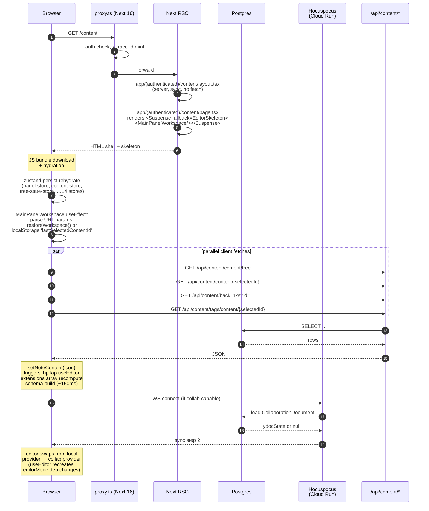
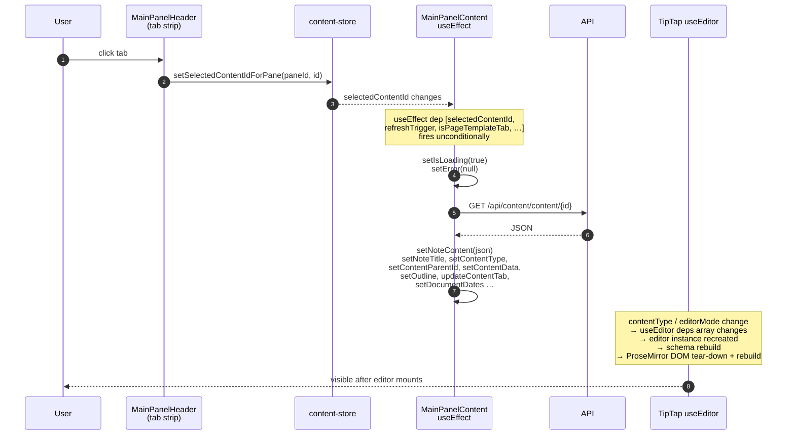

# Page Load & Tab-Change Flow — Current State

**Branch:** `page-load-rework` (off PR #40 `audit/publishing-consistency`)
**Created:** 2026-05-21
**Purpose:** Establish a shared visual of *what actually happens* on cold load, hot reload, and tab change today — so the rework targets real bottlenecks, not assumed ones.

---

## 1. Cold load — first visit to `/content`

### Hot path costs (untimed today — gap)
1. **HTML shell → first paint** — small, server is fast.
2. **JS bundle + hydration** — large (allotment, TipTap, 14 zustand stores, all extensions).
3. **Store rehydration** — synchronous, blocks first effect.
4. **Sequential effects** — `restoreWorkspace` → `setSelectedContentId` → effect-driven `fetch` chain.
5. **TipTap editor build** — ~150ms-ish (estimated, not measured).
6. **Collab promotion** — second editor instance when Hocuspocus connects.

---

## 2. Tab change — clicking another open tab

### Why tab switches feel slow
- **No client cache.** Every tab activation re-issues the same `GET /api/content/content/{id}` — no SWR, no React Query, no Map<id, content>.
- **Editor recreation.** `useEditor` deps include `editorMode` (which encodes provider + content-type). On every selection change, the entire ProseMirror instance is torn down and rebuilt.
- **No "tab cached" path.** A tab that was loaded 5 seconds ago and clicked again pays the same cost as a never-opened tab.
- **Setter cascade.** 8+ `setX` calls in the success branch each trigger a React re-render before the editor receives `initialContent`.

---

## 3. Hard refresh while on `/content?content=abc`

Same as cold load (§1), plus:
- URL params (`content`, `tabs`, `tabs_top_left`, `layout`, `pane`, `workspace`) are parsed in `MainPanelWorkspace` useEffect — *after* hydration, not during SSR. So the panel layout reshape happens visibly post-paint.
- `restoreWorkspace()` may re-open many tabs; each becomes a `selectedContentId` change → see §2 for each.

---

## 4. What instrumentation we have today (covered) vs. don't (gap)

| Phase | Today's signal | Gap |
|---|---|---|
| Browser TTFB / shell paint | none | **need web-vitals (LCP, FCP, TTFB)** |
| Hydration | none | **need a `page:hydrated` marker** |
| Store rehydration | none | per-store rehydrate ms |
| `restoreWorkspace` decision | none | which branch fired, # tabs restored |
| First `fetch /api/content/content/:id` | `withRouteTrace` span on server side ✅ | client-side `fetch:requested → fetch:resolved` not emitted (no `tracedFetch` adoption in MainPanelContent — uses raw `fetch`) |
| TipTap editor build | none | mark mount→ready |
| Hocuspocus connect | server-side `withRouteTrace` on `/api/collaboration/*` ✅, runtime state transitions logged ✅ | client-side connection lifecycle ms |
| Tab switch | none | the whole flow is invisible |
| Server-Timing header | **none** — server traces stay in `.local/debug-payloads/`; browser DevTools network tab doesn't see them | need to inject `Server-Timing` from `withRouteTrace` end |

---

## 5. Observability stack — what exists in the repo

**Server (mature):** `lib/core/logger/`
- `logger.{debug,info,warn,error,fatal}` — closed-set events, scalar-only attrs, redaction, JSON+pretty encoders.
- `withSpan` / `startSpan` — AsyncLocalStorage-backed span tree, auto-paired `:started`/`:completed`/`:failed`, OTel-shaped for future exit.
- `withRouteTrace` — wraps every API route; reads `x-trace-id` header from client; emits HTTP status on completion.
- `withPageTrace` — wraps server components (currently used on `app/(public)/[...path]/page.tsx`).
- `writePayload` + `spanPayload` — sidecar JSONL for bulk data, referenced from logs via `payload_ref`.
- 13 server layers: `route, auth, tree, content, editor, collab, storage, ai, export, external, browser_ext, periodic, admin`.

**Client (newer, partial adoption):** `lib/core/logger/client.ts`
- `clientLogger.{debug,…,fatal}` — mirrors server API surface.
- Trace-id minted on first emit; `resetClientTraceId()` for soft-nav (not yet wired to `useRouter` events — gap).
- `tracedFetch(input, init)` — drop-in fetch wrapper that injects `x-trace-id`. **Adopted in settings only** — `MainPanelContent.tsx` still uses raw `fetch()` for all its 14+ call sites.
- Errors-only beacon to `POST /api/logs/client`; `sendBeacon` w/ fetch+keepalive fallback; batched (max 25 / 5s flush).
- 7 frontend layers: `page, route, ui, editor, store, fetch, error`.

**Trace replay:**
- `pnpm trace:view` → reads `.local/debug-payloads/<trace>.events.jsonl` + `<trace>.jsonl`, emits self-contained HTML at `.local/debug-payloads/trace-<id>.html`.
- `pnpm trace:list` lists available traces newest-first.
- `pnpm clean:traces` (auto on `pnpm dev` predev) archives old traces.

**CI gate:**
- `quality.yml` — eslint `--max-warnings 175` blocks new `console.*` outside `lib/core/logger/`.
- `collaboration-hardening.yml` — Server*-variant coverage check.

**Charter docs:**
- `docs/notes-feature/work-tracking/OBSERVABILITY-CLEANUP-PLAN.md` — three-layer goals (logs, spans, payloads).
- `docs/notes-feature/work-tracking/FRONTEND-LOG-CHARTER.md` — layer + transport + redaction rules.

---

## 6. What's missing to make this rework data-driven

**Tier A — should ship before changing any UX code:**

1. **Web-vitals capture.** Install `web-vitals` v4, emit `clientLogger.info({ layer: "page", event: "page:vitals", attrs: { metric, value, rating } })` for LCP/INP/CLS/TTFB/FCP. Without this, "feels slow" stays a vibe rather than a measurement.
2. **`page:hydrated` and `page:interactive` markers.** A `useEffect` in the root client boundary that fires once on mount; pair with `performance.timeOrigin` to compute `ms-since-navigation`. The charter declared these events but nothing emits them.
3. **`tracedFetch` adoption in `MainPanelContent.tsx`.** Swap the 14 raw `fetch(...)` calls. Each one becomes a `fetch:requested → resolved/failed` event pair with `duration_ms`, end-to-end-correlated with the server's `withRouteTrace`.
4. **Server-Timing header propagation.** On `withRouteTrace` end, attach `Server-Timing: trace;desc="<trace_id>", db;dur=…, total;dur=…`. Now the browser's network tab shows server time inline, and Chrome DevTools "Performance" tab will sample it into flamegraphs.

**Tier B — for the actual tab-switch problem:**

5. **`ui:tab_switch_started / completed` events** keyed on `(from_tab_id, to_tab_id, was_cached)`. Wrap the `setSelectedContentIdForPane` action so every user-visible tab change emits matched spans.
6. **`editor:mount_started / ready` events** with `duration_ms`, `node_count`, `extension_count`. Wrap the TipTap `useEditor` lifecycle. This is the only way to see the editor-recreate cost.
7. **`store:rehydrate_completed` per persisted store** at first render. There are 14 stores — knowing which one takes the longest matters when you start cutting them.
8. **`route:transition_*` markers** wired to `next/navigation`'s `useRouter` events + `resetClientTraceId()` per soft-nav.

**Tier C — nice-to-have but not blocking:**

9. **React Profiler integration** for the editor + workspace tree, gated by `?profile=1` URL flag. Emits `commitTime` per render via `clientLogger.debug`.
10. **`PerformanceObserver` for long tasks** (entryTypes: `longtask`, `event`) — surfaces jank in `clientLogger.warn` when a single task >50ms blocks the main thread.
11. **Trace replay viewer in-browser**, not CLI-only — a `/admin/traces/[id]` page that renders the same flamegraph the HTML replay generates, but without leaving the app.

---

## 7. Recommended next step

Land **Tier A items 1-4 as a single PR off this branch** (no UX changes yet), then re-measure cold load and tab switch with real numbers. The rework itself becomes targeted: cache layer? editor lifecycle? store split? — the traces will tell us, instead of us guessing.
