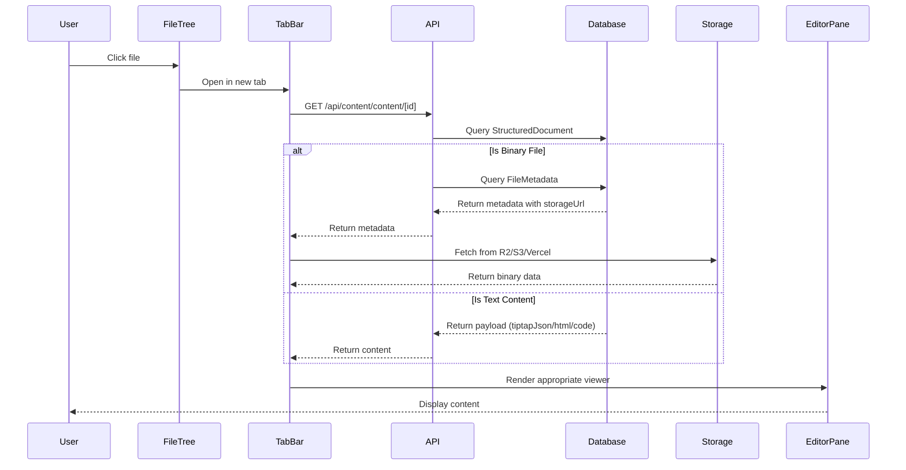
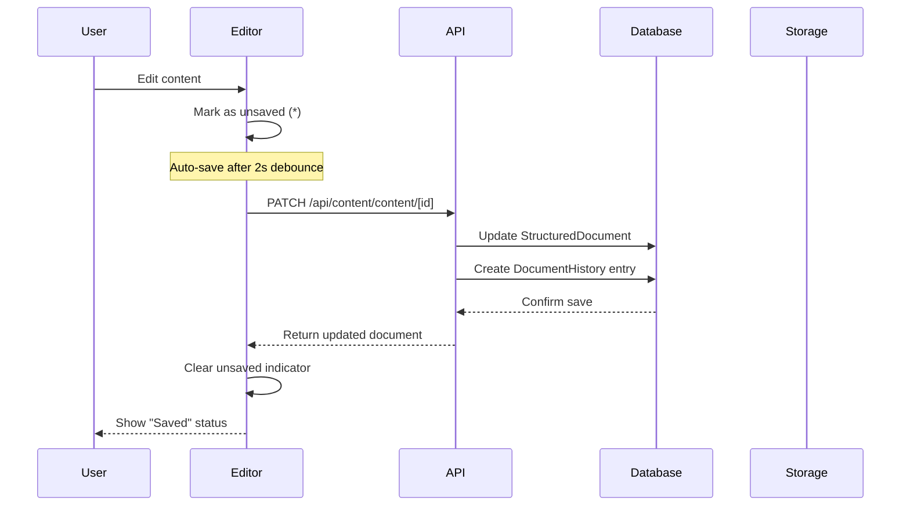
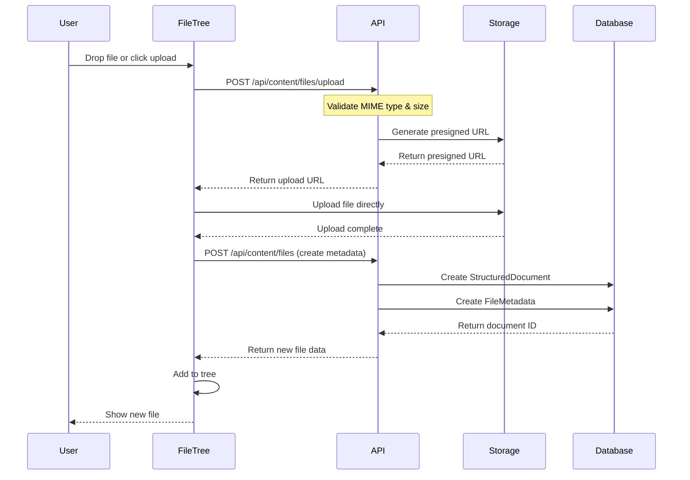
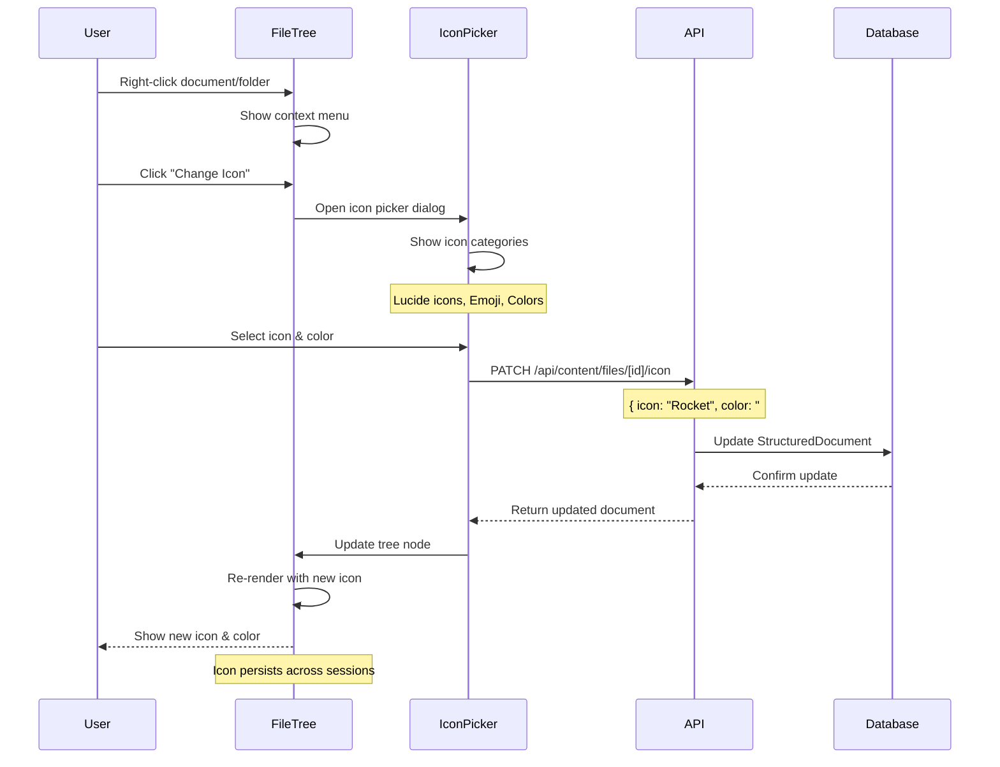
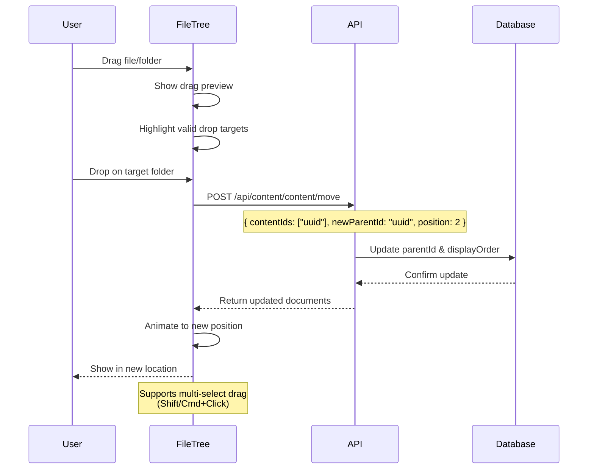

# Architecture

**Version:** 1.0  
**Last Updated:** January 10, 2026

## Overview

The notes feature implements an Obsidian-inspired IDE within the Next.js application, featuring a panel-based layout with resizable sections, tab management, and support for hybrid content (markdown, code, office docs, media files).

## System Architecture

```mermaid
graph TB
    subgraph ClientLayer [Client Layer - Browser]
        NotesLayout[NotesLayout Component]
        LeftSidebar[LeftSidebar<br/>File Tree]
        MainPanel[MainPanel<br/>Tabs & Editor]
        RightSidebar[RightSidebar<br/>Backlinks]
        SideChatBar[SideChatBar<br/>AI Chat UI]
        CommandPalette[CommandPalette<br/>cmdk]
    end

    subgraph StateManagement [State Management]
        PanelState[Panel Layout State<br/>Zustand/Jotai]
        TabState[Tab State<br/>Open Docs]
        FileTreeState[File Tree State<br/>Virtualized]
        EditorState[Editor State<br/>TipTap]
    end

    subgraph APILayer [API Layer - Next.js Routes]
        FilesAPI[/api/content/files]
        ContentAPI[/api/content/content]
        TreeAPI[/api/content/tree]
        SearchAPI[/api/content/search]
        UploadAPI[/api/content/files/upload]
        BacklinksAPI[/api/content/backlinks]
    end

    subgraph DatabaseLayer [Database Layer]
        StructuredDoc[(StructuredDocument)]
        FileMetadata[(FileMetadata)]
        DocumentPath[(DocumentPath)]
        DocumentLink[(DocumentLink)]
    end

    subgraph StorageLayer [Storage Layer]
        R2[Cloudflare R2]
        S3[AWS S3]
        VercelBlob[Vercel Blob]
    end

    NotesLayout --> LeftSidebar
    NotesLayout --> MainPanel
    NotesLayout --> RightSidebar
    NotesLayout --> SideChatBar
    NotesLayout --> CommandPalette

    LeftSidebar --> FileTreeState
    MainPanel --> TabState
    MainPanel --> EditorState

    FileTreeState --> TreeAPI
    TabState --> ContentAPI
    EditorState --> ContentAPI

    FilesAPI --> StructuredDoc
    FilesAPI --> FileMetadata
    ContentAPI --> StructuredDoc
    TreeAPI --> StructuredDoc
    TreeAPI --> DocumentPath
    SearchAPI --> StructuredDoc
    BacklinksAPI --> DocumentLink

    UploadAPI --> R2
    UploadAPI --> S3
    UploadAPI --> VercelBlob
    FileMetadata --> R2
    FileMetadata --> S3
    FileMetadata --> VercelBlob
```

## Component Hierarchy

### Layout Structure

```
/app/notes/layout.tsx (NotesLayout)
├── LeftSidebar
│   ├── FileTree (react-arborist: virtualized + drag-and-drop)
│   │   ├── FolderNode (collapsible, customizable icon)
│   │   ├── FileNode (icon by MIME type or custom)
│   │   └── DocumentNode (markdown/text, custom icons)
│   ├── SearchPanel
│   │   ├── SearchInput
│   │   └── SearchResults
│   └── TagsPanel
│       └── TagList
│
├── MainPanel
│   ├── TabBar
│   │   ├── Tab (with unsaved indicator *)
│   │   ├── Tab
│   │   └── NewTabButton (+)
│   ├── EditorPane
│   │   ├── MarkdownEditor (Novel/TipTap)
│   │   ├── CodeEditor (Monaco or CodeMirror)
│   │   ├── PDFViewer (react-pdf-viewer)
│   │   ├── ImageViewer (with zoom, pan)
│   │   ├── VideoPlayer (HTML5 with controls)
│   │   ├── AudioPlayer (HTML5 with waveform)
│   │   ├── SpreadsheetViewer (handsontable)
│   │   └── GenericFileViewer (download prompt)
│   └── StatusBar
│       ├── SaveStatus (saving, saved, unsaved)
│       ├── StorageIndicator (R2/S3/Vercel icon)
│       ├── WordCount
│       └── FilePath (breadcrumb)
│
├── RightSidebar
│   ├── OutlinePanel (TOC from headers)
│   ├── BacklinksPanel
│   │   └── BacklinksList
│   └── MetadataPanel
│       ├── FileInfo (size, created, modified)
│       ├── TagsEditor
│       └── PropertiesEditor (frontmatter)
│
├── SideChatBar (collapsible, expandable to full-screen)
│   ├── ChatHeader (with full-screen toggle)
│   ├── ConversationList
│   ├── MessageThread
│   ├── MessageInput
│   ├── ModelSelector (UI only, mock)
│   └── FullScreenChat (route: /notes/chat, same component)
│
└── CommandPalette (cmdk)
    ├── CommandInput
    ├── CommandList
    │   ├── FileCommands
    │   ├── EditCommands
    │   ├── ViewCommands
    │   └── SettingsCommands
    └── CommandShortcuts
```

### Sidebar Flexibility

**Interchangeable Sidebars:**

- Left and Right sidebars can swap positions via user settings
- Useful for left-handed users or personal preference
- Smooth animation during position swap

**SideChatBar Full-Screen Mode:**

- Expandable to dedicated `/notes/chat` route
- Same component, different layout wrapper
- Maintains conversation context and state
- Keyboard shortcut: `Cmd+Shift+C` to toggle full-screen
- Breadcrumb navigation to return to notes view

## Data Flow

### Document Loading Flow



### Document Saving Flow



### File Upload Flow



### Icon Customization Flow



### Drag-and-Drop Reorganization Flow



## State Management Strategy

### Panel Layout State

**Library Choice:** Zustand (lightweight, no Provider needed)

```typescript
interface PanelLayoutState {
  leftSidebarWidth: number;
  rightSidebarWidth: number;
  sideChatBarWidth: number;
  leftSidebarCollapsed: boolean;
  rightSidebarCollapsed: boolean;
  sideChatBarCollapsed: boolean;

  // Sidebar interchangeability
  leftSidebarPosition: "left" | "right"; // Default: "left"
  rightSidebarPosition: "left" | "right"; // Default: "right"
  // Users can swap: left sidebar to right, right sidebar to left

  // Active panels
  activeLeftPanel: "files" | "search" | "tags";
  activeRightPanel: "outline" | "backlinks" | "metadata";

  // Chat full-screen mode
  chatFullScreen: boolean; // When true, chat takes over main area
}

// Persisted to localStorage as 'notes-panel-layout'
```

### Tab Management State

```typescript
interface TabState {
  openTabs: Tab[];
  activeTabId: string | null;
  recentlyClosedTabs: Tab[];
}

interface Tab {
  id: string;
  contentId: string;
  title: string;
  type: "markdown" | "code" | "pdf" | "image" | "video" | "other";
  hasUnsavedChanges: boolean;
  scrollPosition: number;
  cursorPosition?: number;
}

// Persisted to localStorage as 'notes-tabs'
```

### File Tree State

```typescript
interface FileTreeState {
  expandedFolders: Set<string>;
  selectedNodeId: string | null;
  treeData: TreeNode[];
  filterQuery: string;
  sortBy: "name" | "modified" | "created" | "type";
  sortOrder: "asc" | "desc";
}

// Only expandedFolders persisted to localStorage
```

## Integration with Existing Application

### Authentication & Authorization

Reuses existing `lib/auth/middleware.ts`:

```typescript
// In API routes
import { requireAuth, requireRole } from "@/lib/auth/middleware";

export async function GET(request: Request) {
  const session = await requireAuth();
  // User is authenticated, proceed
}

// For admin-only operations
export async function DELETE(request: Request) {
  await requireRole("admin" | "owner");
  // User has admin privileges
}
```

### Database Integration

Uses ContentNode + Typed Payload architecture (Database Design v2.0):

- **ContentNode:** Universal tree node (identity, hierarchy, permissions)
- **Typed Payloads:** NotePayload, FilePayload, HtmlPayload, CodePayload (1:1 with ContentNode)
- **Type Derivation:** contentType determined by payload presence, not string field
- **Upload State Machine:** FilePayload.uploadStatus gates UI actions

### Design System Integration

Uses existing design tokens and components:

```typescript
import { COLORS, BRANCH_COLORS } from "@/lib/design-system";
import { Button } from "@/components/client/ui/button";
import { Input } from "@/components/client/ui/input";
import { Tabs, TabsList, TabsTrigger } from "@/components/client/ui/tabs";
```

### Navigation Integration

The notes feature lives at `/app/notes/` with its own layout that:

- Bypasses the main navigation tree, but shares the same design principles and styling as the home page navigation tree.
- Includes logo component in corner for return to home page (instead of in the middle of the navbar)
- Can be accessed from main navigation as a category link

## Performance Considerations

### Virtualization

**File Tree:** Only render visible nodes (50-100 at a time) using `@tanstack/react-virtual`

```typescript
const virtualizer = useVirtualizer({
  count: flattenedTree.length,
  getScrollElement: () => containerRef.current,
  estimateSize: () => 32, // 32px per row
  overscan: 5,
});
```

### Code Splitting

```typescript
// Lazy load heavy editors
const MarkdownEditor = lazy(() => import('@/components/content/MarkdownEditor'));
const CodeEditor = lazy(() => import('@/components/content/CodeEditor'));
const PDFViewer = lazy(() => import('@/components/content/PDFViewer'));

// Use with Suspense
<Suspense fallback={<EditorSkeleton />}>
  <MarkdownEditor content={content} />
</Suspense>
```

### Caching Strategy

- **React Query** for API data caching with 5-minute stale time
- **Service Worker** for offline file access (future enhancement)
- **IndexedDB** for large file metadata caching

## Responsive Behavior

### Breakpoints

```typescript
const breakpoints = {
  mobile: "(max-width: 768px)",
  tablet: "(min-width: 769px) and (max-width: 1024px)",
  desktop: "(min-width: 1025px)",
};
```

### Mobile Adaptations

- **Single panel view:** MainPanel only, sidebars accessible via drawer/modal
- **Tab overflow:** Horizontal scroll with indicator dots
- **Touch gestures:** Swipe to close tabs, pinch to zoom images
- **Command palette:** Full-screen on mobile

### Tablet Adaptations

- **Two-panel view:** LeftSidebar + MainPanel (RightSidebar hidden by default)
- **Collapsible sidebars:** User can show/hide as needed
- **Adaptive tab bar:** Shows 4-6 tabs before overflow menu

## Accessibility Architecture

### Keyboard Navigation

- **Cmd/Ctrl + K:** Open command palette
- **Cmd/Ctrl + P:** Quick file search
- **Cmd/Ctrl + S:** Save current document
- **Cmd/Ctrl + W:** Close current tab
- **Cmd/Ctrl + Tab:** Switch between tabs
- **Cmd/Ctrl + B:** Toggle left sidebar
- **Cmd/Ctrl + \\:** Toggle right sidebar
- **Arrow keys:** Navigate file tree
- **Enter:** Open file
- **Escape:** Close modals/palettes

### Screen Reader Support

- Proper ARIA labels for all interactive elements
- Live regions for status updates ("Saving...", "Saved")
- Semantic HTML (`<nav>`, `<main>`, `<aside>`)
- Focus management when opening modals

### Focus Management

```typescript
// When opening command palette
const commandPaletteRef = useRef<HTMLInputElement>(null);

useEffect(() => {
  if (isOpen) {
    commandPaletteRef.current?.focus();
  }
}, [isOpen]);

// Trap focus within modal
useFocusTrap(modalRef, isOpen);
```

## Error Handling Architecture

### Error Boundaries

```typescript
<ErrorBoundary fallback={<ErrorFallback />}>
  <NotesLayout>
    {/* App content */}
  </NotesLayout>
</ErrorBoundary>
```

### API Error Handling

```typescript
try {
  const response = await fetch("/api/content/content/123");
  if (!response.ok) {
    throw new APIError(response.status, await response.json());
  }
} catch (error) {
  if (error instanceof APIError) {
    toast.error(error.userMessage);
    logError(error); // Send to monitoring service
  }
}
```

### Offline Detection

```typescript
const { isOnline } = useNetworkStatus();

if (!isOnline) {
  return <OfflineBanner message="You're offline. Changes will sync when reconnected." />;
}
```

## Extension Points

### Plugin Architecture (Future)

The architecture supports future plugin system:

```typescript
interface NotesPlugin {
  id: string;
  name: string;
  version: string;

  // Lifecycle hooks
  onLoad?: () => void;
  onUnload?: () => void;

  // Extension points
  registerCommands?: () => Command[];
  registerFileTypes?: () => FileTypeHandler[];
  registerEditors?: () => EditorComponent[];
  registerViewers?: () => ViewerComponent[];
}
```

### Custom File Type Handlers

```typescript
interface FileTypeHandler {
  mimeTypes: string[];
  extensions: string[];
  icon: IconComponent;
  viewer: ViewerComponent;
  editor?: EditorComponent;
  canPreview: boolean;
}

// Register custom handler
registerFileType({
  mimeTypes: ["application/x-custom"],
  extensions: [".custom"],
  icon: CustomIcon,
  viewer: CustomViewer,
  canPreview: true,
});
```

## Next Steps

1. Review [Technology Stack](./02-technology-stack.md) for library decisions
2. Study [Database Design](./03-database-design.md) for schema changes
3. See [UI Components](./06-ui-components.md) for detailed component specs
4. Follow [Implementation Guide](./11-implementation-guide.md) for build phases
