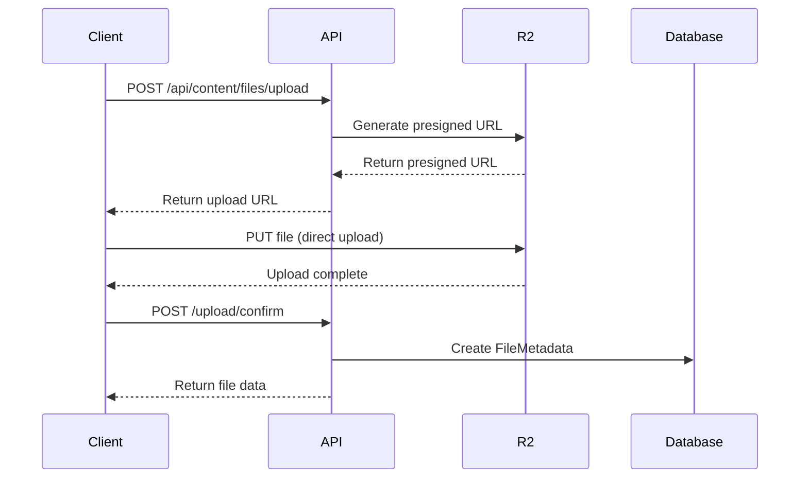

# File Storage

**Version:** 1.0  
**Last Updated:** January 10, 2026

## Overview

The notes feature supports three cloud storage providers with seamless switching:
- **Cloudflare R2** (default, S3-compatible)
- **AWS S3**
- **Vercel Blob**

## Storage Architecture

### Direct Upload Flow


## Cloudflare R2 Implementation

### Configuration
```typescript
// lib/storage/r2.ts
import { S3Client, PutObjectCommand } from '@aws-sdk/client-s3';
import { getSignedUrl } from '@aws-sdk/s3-request-presigner';

const r2Client = new S3Client({
  region: 'auto',
  endpoint: `https://${process.env.CLOUDFLARE_R2_ACCOUNT_ID}.r2.cloudflarestorage.com`,
  credentials: {
    accessKeyId: process.env.CLOUDFLARE_R2_ACCESS_KEY_ID!,
    secretAccessKey: process.env.CLOUDFLARE_R2_SECRET_ACCESS_KEY!,
  },
});

export async function getR2PresignedUrl(key: string, mimeType: string) {
  const command = new PutObjectCommand({
    Bucket: process.env.CLOUDFLARE_R2_BUCKET!,
    Key: key,
    ContentType: mimeType,
  });
  
  const url = await getSignedUrl(r2Client, command, { expiresIn: 3600 });
  return url;
}
```

### Environment Variables
```env
CLOUDFLARE_R2_ACCOUNT_ID=your-account-id
CLOUDFLARE_R2_ACCESS_KEY_ID=your-access-key
CLOUDFLARE_R2_SECRET_ACCESS_KEY=your-secret-key
CLOUDFLARE_R2_BUCKET=digital-garden-files
CLOUDFLARE_R2_PUBLIC_URL=https://files.yourdomain.com
```

## AWS S3 Implementation

### Configuration
```typescript
// lib/storage/s3.ts
import { S3Client } from '@aws-sdk/client-s3';

const s3Client = new S3Client({
  region: process.env.AWS_S3_REGION!,
  credentials: {
    accessKeyId: process.env.AWS_S3_ACCESS_KEY_ID!,
    secretAccessKey: process.env.AWS_S3_SECRET_ACCESS_KEY!,
  },
});

export async function getS3PresignedUrl(key: string, mimeType: string) {
  const command = new PutObjectCommand({
    Bucket: process.env.AWS_S3_BUCKET!,
    Key: key,
    ContentType: mimeType,
    ServerSideEncryption: 'AES256',
  });
  
  const url = await getSignedUrl(s3Client, command, { expiresIn: 3600 });
  return url;
}
```

## Vercel Blob Implementation

### Configuration
```typescript
// lib/storage/vercel-blob.ts
import { put } from '@vercel/blob';

export async function uploadToVercelBlob(file: File, key: string) {
  const blob = await put(key, file, {
    access: 'public',
    token: process.env.VERCEL_BLOB_READ_WRITE_TOKEN!,
  });
  
  return blob.url;
}
```

## Unified Storage Interface

```typescript
// lib/storage/index.ts
export interface StorageProvider {
  getPresignedUploadUrl(key: string, mimeType: string): Promise<string>;
  getPresignedDownloadUrl(key: string): Promise<string>;
  deleteFile(key: string): Promise<void>;
  getFileUrl(key: string): string;
}

export function getStorageProvider(provider: 'r2' | 's3' | 'vercel'): StorageProvider {
  switch (provider) {
    case 'r2':
      return new R2Provider();
    case 's3':
      return new S3Provider();
    case 'vercel':
      return new VercelBlobProvider();
  }
}
```

## File Organization

### Storage Key Structure
```
files/
  {userId}/
    {documentId}/
      original.{ext}          # Original file
      thumbnail.jpg           # Generated thumbnail
      preview.webp            # Preview image
      metadata.json           # Additional metadata
```

## CDN Integration

### Cloudflare CDN (for R2)
```typescript
// R2 automatically integrates with Cloudflare CDN
const publicUrl = `https://files.yourdomain.com/${key}`;
```

### AWS CloudFront (for S3)
```typescript
const cloudFrontUrl = `https://d1234567890.cloudfront.net/${key}`;
```

## Thumbnail Generation

```typescript
// lib/storage/thumbnails.ts
import sharp from 'sharp';

export async function generateThumbnail(buffer: Buffer): Promise<Buffer> {
  return sharp(buffer)
    .resize(300, 300, { fit: 'cover' })
    .jpeg({ quality: 80 })
    .toBuffer();
}

// In upload confirm handler
if (mimeType.startsWith('image/')) {
  const originalBuffer = await downloadFile(storageKey);
  const thumbnailBuffer = await generateThumbnail(originalBuffer);
  const thumbnailKey = storageKey.replace(/\.[^.]+$/, '-thumb.jpg');
  await uploadFile(thumbnailKey, thumbnailBuffer);
  
  await prisma.fileMetadata.update({
    where: { id },
    data: { thumbnailUrl: getFileUrl(thumbnailKey) },
  });
}
```

## Cost Comparison

| Provider | Storage | Egress (Download) | Requests |
|----------|---------|-------------------|----------|
| R2 | $0.015/GB | Free | $0.36/million |
| S3 | $0.023/GB | $0.09/GB | $0.40/million |
| Vercel Blob | $0.15/GB | $0.10/GB | Included |

**Recommendation:** R2 for cost-effectiveness with free egress

## Next Steps

1. Review [Database Design](./03-database-design.md) for FileMetadata schema
2. See [API Specification](./04-api-specification.md) for upload endpoints
3. Check [Security Model](./05-security-model.md) for presigned URL security

